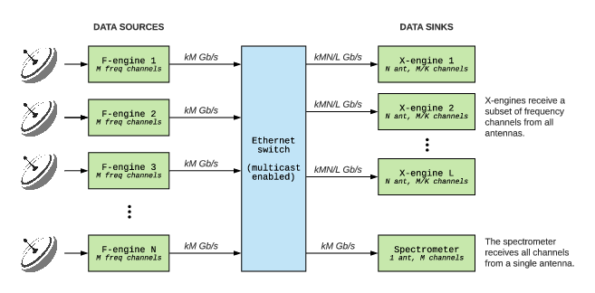
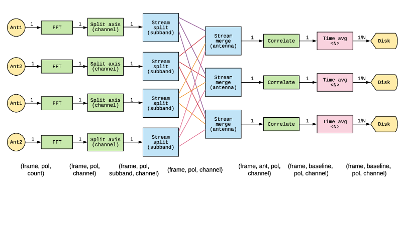
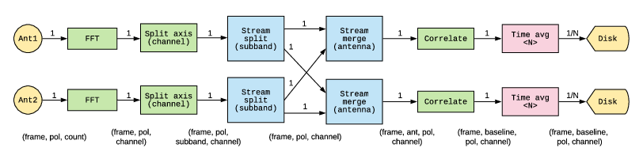
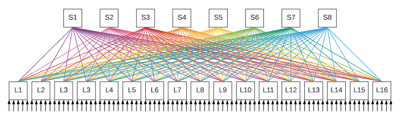
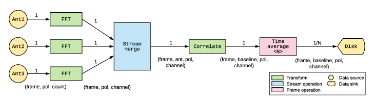
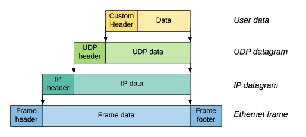

### Stream processing in radio astronomy

These diagrams are licensed under [CC-BY 4.0](https://creativecommons.org/licenses/by/4.0/). 
So, you can use these in a thesis / paper / blog post, as long as you follow the CC-BY rules.

##### casper-arch.pdf

##### data-stream-cornerturn.pdf

##### data-stream-example2.pdf

##### clos-network.pdf

##### data-stream-example.pdf

##### udp-stackup.pdf

